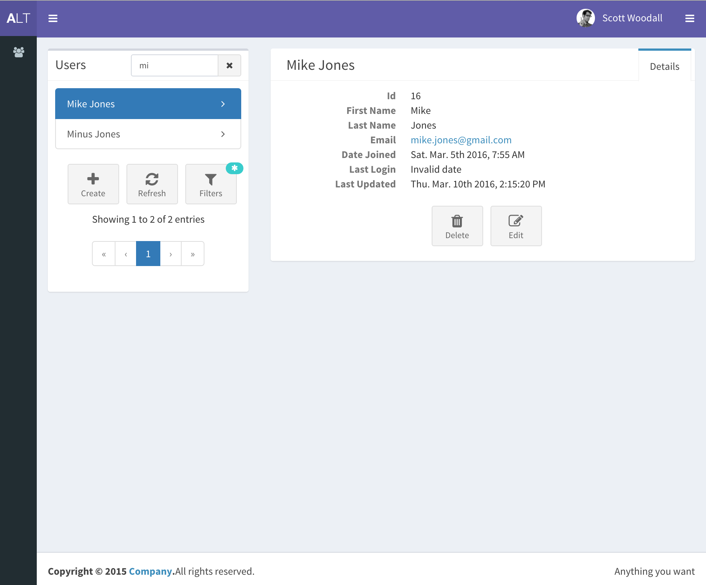

# A Django & React Template
A collection of Django and React modules that will help bootstrap your next Django web
application.

## Motivation
Getting a new project up and running can be time consuming and demotivating when
what you really want is to just work on your idea. It can take hours/days to get
through all the boilerplate before you can get to any actual work.

The goal of this project is to give you a strong, modern project with just a few
commands so you can begin writing your application from the start and not worry about
boilerplate.

## Installation
```
export project_name={{ project_name }}
mkvirtualenv $project_name
pip install django
django-admin.py startproject --template=https://github.com/scottwoodall/django-react-template/archive/master.zip $project_name
cd $project_name
```
1. Follow [backend/README.md](backend/README.md)
1. Follow [frontend/README.md](frontend/README.md)

## TODO
1. Build production configs

## Screenshot

